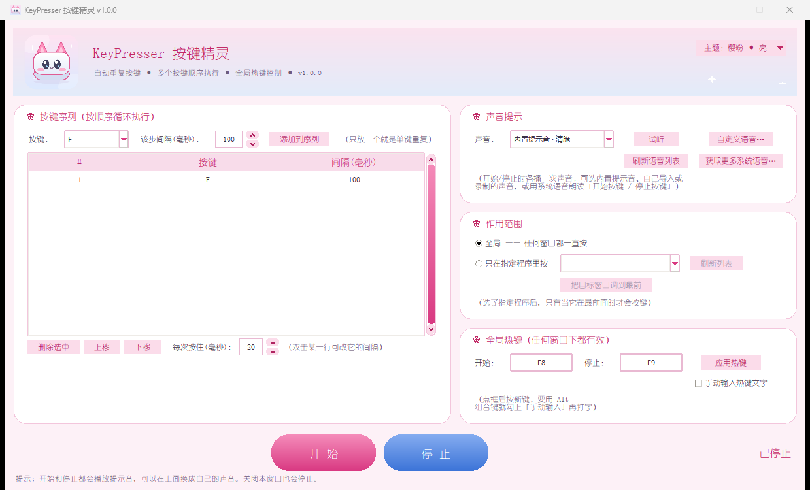

# KeyPresser 按键精灵


一个 Windows 上的小工具：**按设定的间隔自动重复按键**。可以只重复一个键，
也可以把多个键排成序列按顺序循环执行；带全局热键、声音提示，可以只对指定程序生效。



用 Python 标准库写成，**不依赖任何第三方库**，界面基于 tkinter。
界面是二次元风格的淡粉配色 + 圆角卡片，配一只**原创的猫耳键帽吉祥物**
（下图和程序图标都是代码画出来的，不是网上找的素材）。


> A tiny Windows utility that repeats keystrokes on an interval — one key, or a
> sequence of keys run in a loop. Global hotkeys, sound cues, per-application
> scope, four switchable themes. Pure Python standard library, no dependencies,
> MIT licensed. ([English summary](#english))

---

## 下载与安装

### 方式一：直接用打包好的 exe（推荐给普通用户）

到 [Releases](https://github.com/hcb9291/KeyPress/releases) 页面下载
`KeyPresser.exe`，双击就能用，**不需要安装 Python**。

第一次运行时 Windows 可能提示"未知发布者"，点"仍要运行"即可——
这个 exe 没有买代码签名证书，属于正常现象。

### 方式二：用源码运行

需要 Python 3.8 以上（自带 tkinter），不需要装任何额外的库：

```
python main.py
```

也可以直接双击 `run.bat`。

### 方式三：自己打包成 exe

双击 `build.bat`。脚本会自动创建虚拟环境、安装 PyInstaller 并打包，
产物在 `dist\KeyPresser.exe`，单文件、免 Python 环境。

---

## 功能

### 按键序列

- 从下拉框里选键（F1~F12、字母、数字、空格、回车、方向键等）加到列表里；
- 列表里有几个键，就按顺序循环执行几个键；**只放一个键，就是重复按这一个键**；
- 每一步可以单独设间隔（双击列表里的一行就能改）；
- 支持删除、上移、下移，调整执行顺序；
- 另外可以统一设定「每次按住」的时长（毫秒）。

### 全局热键

默认 `F8` 开始、`F9` 停止，在任何窗口下都有效，也可以自己改
（支持 `Ctrl+Alt+K` 这类组合键）。不想用热键时，直接点界面上的按钮也行。

### 声音提示

开始和停止各播一次声音，三种来源任选：

1. **内置提示音** —— 程序自带三套不同音色的提示音：清脆 / 柔和 / 低沉。
   每套都是**开始音往上走、停止音往下走**（停止音更长更低），
   不用看屏幕也能听出是"开启"还是"停止"。全部由代码合成，随项目自由使用。
2. **自定义语音** —— 导入自己的 `wav` 文件，或**直接用麦克风录一段**。
3. **系统语音** —— 调用 Windows 自带的中文语音朗读「开始按键 / 停止按键」；
   可以点「获取更多系统语音…」去 Windows 设置里添加更多语音，
   装好后点「刷新语音列表」就会出现在下拉框里。

### 作用范围

- **全局**：任何窗口都一直按；
- **指定程序**：只有选中的那个程序在最前面时才按，切走自动暂停、切回来继续。

### 主题

界面右上角有「主题：xxx」按钮，点开就能换肤，选择会被记住。自带 4 套：

| 主题 | 风格 |
| --- | --- |
| 樱粉 · 亮 | 粉色系（默认） |
| 樱粉 · 暗 | 粉色系暗色，晚上不刺眼 |
| 薄荷 · 亮 | 青绿系 |
| 星夜 · 暗 | 深蓝 + 青色暗色 |

---

## 快速上手

1. 在「按键序列」里选一个键，点「添加」；要多个键就多添加几步，每步都能单独设间隔；
2. 选「声音提示」的来源，点「试听」确认能听到；
3. 选「作用范围」（一般保持"全局"就行）；
4. 设置开始 / 停止热键；
5. 按 `F8` 开始，按 `F9` 停止；也可以直接点界面底部的按钮。

---

## 文件说明

| 文件 | 说明 |
| --- | --- |
| `main.py` | 全部程序代码（界面、按键、热键、语音、主题） |
| `themes.json` | **主题的原始数据文件**：每套主题就是一组颜色，改配色 / 加主题都改这里 |
| `tts_synth.ps1` | 调用 Windows 自带语音合成，把文字转成 wav（只有"系统语音"模式会用到） |
| `assets/icon.ico` / `icon.png` / `icon_512.png` | 程序图标（窗口、任务栏、exe 都用它） |
| `assets/mascot.png` | 吉祥物（界面顶部横幅用） |
| `assets/header.png` | 顶部横幅图（仓库展示用） |
| `assets/screenshot.png` | 界面截图（就是上面那张） |
| `sounds/*_start.wav` / `*_stop.wav` | 三套内置提示音（chime / soft / deep） |
| `tools/make_assets.py` | 生成上面这些图标和提示音的脚本 |
| `tools/selfcheck.py` | 项目自检（素材是否齐全、主题数据是否合法、有没有混进隐私内容） |
| `build.bat` / `run.bat` | 打包 / 运行 |
| `docs/RELEASING.md` | 发布新版本的流程 |
| `CHANGELOG.md` | 更新日志 |

设置文件和你导入、录制的语音**不会放在程序目录**，而是统一保存在：

```
%APPDATA%\KeyPresser\settings.json          设置
%APPDATA%\KeyPresser\custom_voice\          自己导入 / 录制的开始音、停止音
%TEMP%\keypresser_tts\                      系统语音合成缓存
```

所以程序所在目录始终只有一个程序文件，干净整洁。

---

## 自定义主题

主题数据来自 `themes.json`，里面每个主题是 `id + name + colors`，
colors 共 25 个颜色键（背景、卡片、描边、标题、正文、说明文字、主色、停止色、输入框、表格…）。

程序启动时按这个顺序找主题文件：**程序（exe / 脚本）所在目录 → 打包资源里**。
所以想自己换一套配色，有两种办法：

1. 把 `themes.json` 拷到 exe 旁边直接改（程序优先读这一份）；
2. 或者改源码里的 `BUILTIN_THEMES`（`themes.json` 丢失时的兜底数据，内容与文件一致）。

改完重启程序即可，切换用的还是右上角那个「主题」按钮。

---

## 素材与版权

本项目的图标、吉祥物、横幅和内置音效**全部由 `tools/make_assets.py` 用代码生成**，
没有任何第三方素材：

- `assets/icon.ico`、`icon.png`、`icon_512.png`、`mascot.png`、`header.png`：
  全部由 `tools/make_assets.py` 用代码绘制，形象是自己设计的（猫耳键帽），
  不参考、也不包含任何现有作品或角色的素材；
- `sounds/chime_*.wav`、`soft_*.wav`、`deep_*.wav`：由 `tools/make_assets.py`
  用正弦波合成。

所以它们不涉及任何素材授权问题，可以随本项目自由使用（本项目采用 MIT 协议）。

「系统语音」模式在**用户自己的电脑上实时调用 Windows 内置语音**，
仓库里不分发任何音频文件；「自定义语音」模式用的是用户自己提供或录制的声音。

> 提醒（也给以后改这个项目的人）：不要把从第三方语音服务（各种在线 TTS、配音网站）
> 生成或下载的音频打包进仓库再发布——那些音频的授权通常不允许再分发。

---

## 常见问题

**按了热键没反应？**
多半是热键被别的程序占用了。换一组组合键，或者直接用界面按钮。

**按键送不进目标程序？**
如果目标程序是**以管理员身份运行**的，本程序也要以管理员身份运行才能把按键送进去
（Windows 的权限隔离决定的）。

**在游戏里没用？**
模拟按键会被反作弊系统忽略或拦截，属于正常现象——这个工具不是为游戏设计的。

**导入语音失败？**
目前只接受 `.wav`。其它格式请先用系统「录音机」或本程序自带的「录制」功能转成 wav。

**热键、录音点了没反应，或者界面不对？**
如果在沙箱 / 虚拟机 / 受限环境里跑，语音和窗口相关的系统接口可能被拦下来；
换到正常的桌面环境运行即可。

---

## 已知限制

- 只支持 Windows（用到了 `SendInput`、`mciSendString`、Windows 语音等系统接口）；
- 「自定义语音」导入目前只接受 `.wav`；
- 目标程序以管理员身份运行时，本程序也需要以管理员身份运行；
- 按键是"模拟按键"，部分反作弊严格的游戏会忽略它。

---

## 参与贡献

欢迎提 Issue 和 PR，具体约定见 [CONTRIBUTING.md](CONTRIBUTING.md)；
项目遵循 [CODE_OF_CONDUCT.md](CODE_OF_CONDUCT.md)（行为准则）。
安全问题请不要开公开 Issue，按 [SECURITY.md](SECURITY.md) 里的方式反馈。

版本变化记录在 [CHANGELOG.md](CHANGELOG.md)，发布流程在 [docs/RELEASING.md](docs/RELEASING.md)。

---

## 免责声明

本工具用于自动化重复性的按键操作。请遵守你所用软件的服务条款；
在网游或其他在线服务中使用自动化工具可能违反其用户协议，风险自负。

## 许可证

[MIT](LICENSE)

---

## English

**KeyPresser** is a small Windows tool that repeats keystrokes on an interval:
put one key in the list to repeat that key, or several keys to run them in a
loop — each step has its own interval. It comes with global hotkeys (F8 start /
F9 stop by default), three kinds of sound cue (built-in chimes, your own WAV or
a recording, or Windows text-to-speech), a per-application scope option, and
four switchable themes.

It uses the Python standard library only (tkinter for the UI), so there is
nothing to `pip install`: run `python main.py`, or grab the prebuilt single-file
`KeyPresser.exe` from the
[Releases](https://github.com/hcb9291/KeyPress/releases) page.

All icons, the mascot, the banner and the sound effects are generated by code
(`tools/make_assets.py`) — no third-party assets are bundled. MIT licensed.
